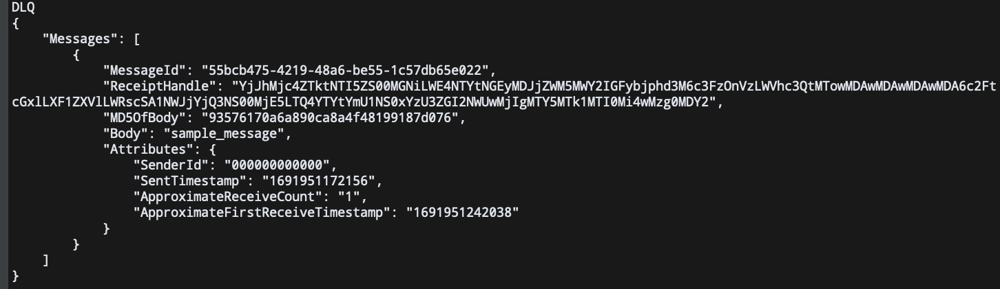

# sqs-dlq-demo

## Expected behavior?
Once we have consumed a message from an SQS queue upto its `maxReceiveCount` and not acknowledged its receipt by deleting it from the queue, the message should be pushed to its DLQ.

## What is happening?
The test is unable to consume message from DLQ although the message is present in the DLQ when read through `aws-cli`

## Investigation done till now
 - Ensured that the `DelaySeconds` is set to 0 for DLQ so that there is no delay for messages being visible
 - Verified that messages are being pushed to SQS DLQ by querying DLQ through CLI